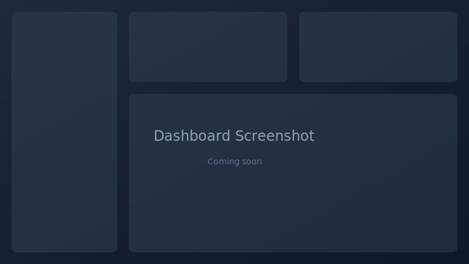
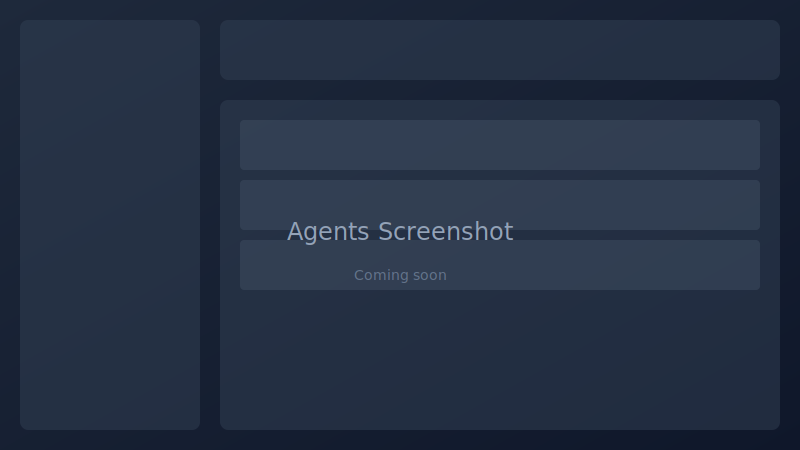
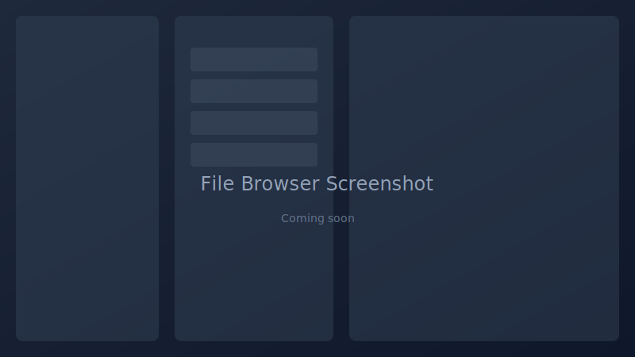
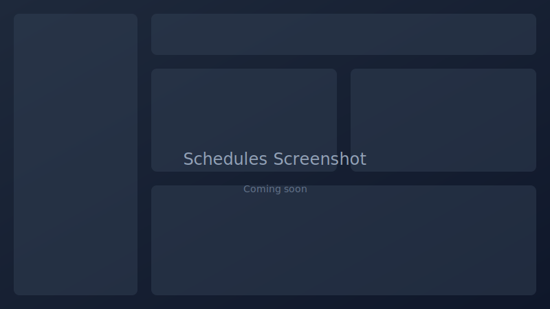

<p align="center">
  
</p>

<h1 align="center">Keldris</h1>
<p align="center"><strong>Secure Keeper of Your Data</strong></p>

<p align="center">
  Self-hosted backup management with OIDC auth. Built on Restic.<br>
  <em>For teams that outgrew basic backup tools but don't want to pay enterprise pricing.</em>
</p>

<p align="center">
  
  
  
  
</p>

---

> ⚠️ **Active development** - Core features work but still polishing. Star the repo to follow along!

## Screenshots

<p align="center">
  <br>
  <em>Dashboard - backup status at a glance</em>
</p>

<p align="center">
  <br>
  <em>Agent management across your infrastructure</em>
</p>

<p align="center">
  <br>
  <em>Browse and restore files from any snapshot</em>
</p>

<p align="center">
  <br>
  <em>Flexible cron-based scheduling</em>
</p>

---

## Why I'm building this

I wanted a backup solution that could:
- Use existing OIDC/SSO infrastructure (not another set of credentials)
- Manage Restic repos across multiple machines from one UI
- Actually tell me when backups fail
- Handle multi-tenant environments properly

...I couldn't find one. So I'm building it.

## Features

- **OIDC-first auth** - Authentik, Keycloak, whatever you use
- **Agent-based** - Small Go binary on each machine, talks to central server
- **Restic under the hood** - Encryption, deduplication, the good stuff
- **Multi-tenant** - Orgs and RBAC built in
- **Dark mode** - Because we're not animals

---

## Status

### Implemented
- Restic-powered encrypted backups with deduplication
- Flexible cron-based scheduling with retention policies
- OIDC authentication (tested with Authentik, Keycloak)
- SSO group sync
- Go agent for Linux, macOS, and Windows
- Storage backends: S3, B2, Dropbox, local, SFTP, REST
- Full restore UI with file browser
- Snapshot comparison (diff between backups)
- File version history browser
- Agent health monitoring with history
- Backup tagging and organization
- Pre/post backup scripts
- Network mount detection and handling
- Docker backup support
- Email notifications
- Slack notifications
- Discord notifications
- Teams notifications
- PagerDuty notifications
- Multi-org with RBAC
- Audit logging
- SLA tracking
- Cost estimation
- Dark mode
- White label support
- Air gap deployment
- First-run onboarding wizard
- DR runbook generation
- DR test automation
- Prometheus metrics endpoint
- Docker deployment

### In Progress
- Agent CLI backup/restore commands
- Email report delivery
- UI polish and bug fixes

### Roadmap
- Snapshot mounting (FUSE)
- Import existing Restic repos
- Mobile-friendly improvements

---

## Tech Stack

| Component | Technology |
|-----------|------------|
| **Server** | Go 1.25.7+ / Gin / PostgreSQL |
| **Agent** | Go 1.25.7+ / Cobra |
| **Frontend** | React 18 / TypeScript / Vite / Tailwind CSS |
| **Authentication** | OIDC (coreos/go-oidc) |
| **Backup Engine** | Restic |
| **State Management** | TanStack Query |
| **Linting** | Biome (frontend) / staticcheck (Go) |

---

## Getting started

Not ready for general use yet. If you want to poke around:

```bash
git clone https://github.com/MacJediWizard/keldris.git
cd keldris
cp .env.example .env
# Edit .env with your OIDC settings
docker-compose up -d
```

You'll need Docker, Go 1.25.7+ (for security patches), PostgreSQL 15+, and an OIDC provider.

---

## Architecture

```
┌─────────────────────────────────────────────────────────────────┐
│                        keldris-server                           │
│  ┌──────────────┐  ┌──────────────┐  ┌──────────────────────┐   │
│  │   React UI   │  │   Go API     │  │    PostgreSQL        │   │
│  │  (Vite/TS)   │  │  (Gin)       │  │    (Multi-tenant)    │   │
│  └──────────────┘  └──────────────┘  └──────────────────────┘   │
└─────────────────────────────────────────────────────────────────┘
                           │ HTTPS
            ┌──────────────┼──────────────┐
            │              │              │
     ┌──────┴─────┐ ┌──────┴─────┐ ┌──────┴─────┐
     │  keldris   │ │  keldris   │ │  keldris   │
     │   agent    │ │   agent    │ │   agent    │
     │  (Linux)   │ │  (macOS)   │ │ (Windows)  │
     └────────────┘ └────────────┘ └────────────┘
            │              │              │
            ▼              ▼              ▼
     ┌─────────────────────────────────────────┐
     │         Storage Backends                │
     │   S3 / B2 / Dropbox / Local / NFS       │
     └─────────────────────────────────────────┘
```

---

## Development

```bash
# Install dependencies
make deps

# Run development servers
make dev

# Run tests
make test

# Run linters
make lint

# Build everything
make build
```

---

## Editions

Keldris is available in three editions:

| Feature | Free | Pro | Enterprise |
|---------|:----:|:---:|:----------:|
| Encrypted backups (Restic) | ✓ | ✓ | ✓ |
| Cross-platform agent | ✓ | ✓ | ✓ |
| Web UI | ✓ | ✓ | ✓ |
| Cron scheduling | ✓ | ✓ | ✓ |
| Local & S3 storage | ✓ | ✓ | ✓ |
| Basic OIDC auth | ✓ | ✓ | ✓ |
| All storage backends | | ✓ | ✓ |
| Advanced retention policies | | ✓ | ✓ |
| Multi-organization | | ✓ | ✓ |
| Webhook notifications | | ✓ | ✓ |
| Advanced reporting | | ✓ | ✓ |
| Priority email support | | ✓ | ✓ |
| SAML/SSO providers | | | ✓ |
| Audit compliance reports | | | ✓ |
| Custom integrations | | | ✓ |
| SLA & dedicated support | | | ✓ |
| **Price** | **Free** | **$9/agent/mo** | **Contact us** |

The Free edition is open-source under AGPLv3. Pro and Enterprise are commercial licenses.

---

## Security

Keldris is built with security as a priority:

- **OIDC-first authentication** - No local passwords; delegates to your identity provider
- **Encryption at rest** - Backup credentials and sensitive configuration encrypted with AES-256-GCM
- **Session hardening** - HttpOnly, Secure, SameSite=Lax cookies with configurable idle and absolute timeouts
- **Security headers** - CSP, HSTS, X-Frame-Options, and more applied by default
- **Rate limiting** - Per-IP rate limiting with optional Redis backend for distributed deployments
- **Multi-tenant isolation** - All queries scoped to organization ID
- **Audit logging** - Track administrative actions for compliance

For production deployment, see:

- [Production Security Guide](docs/production-security.md) - Hardening recommendations
- [Security Checklist](docs/security-checklist.md) - Pre-deployment checklist and proxy configuration

---

## Contributing

PRs welcome once this is more stable. For now, feel free to open issues.

---

## License

AGPLv3 (Free edition) - See [LICENSE](LICENSE)

Pro and Enterprise editions are available under commercial license.
